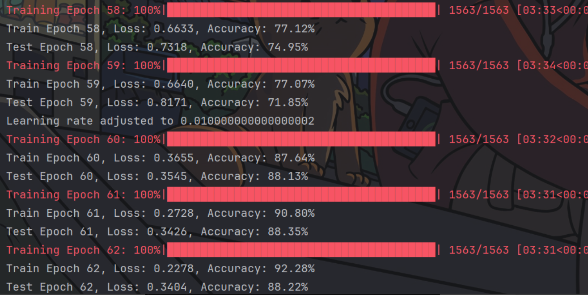
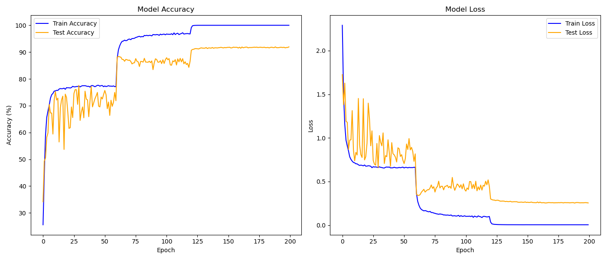
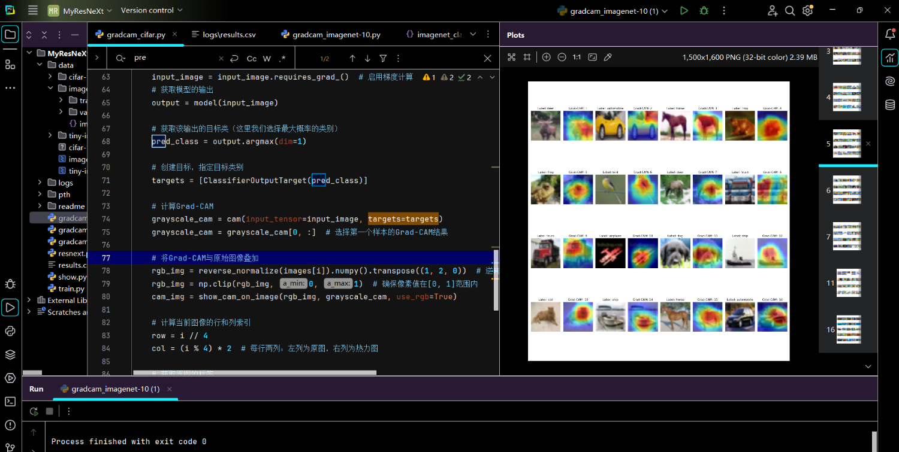

# Computer Vision Class Report

## Assignment Overview

This is the codebase for our Computer Vision class report. The report includes the experiments and analysis we conducted during the course.

## Project Overview

In this project, we completed the following tasks:  
- Defined tasks and objectives.  
- Loaded and preprocessed the dataset.  
- Trained and evaluated the model. 
<div style="text-align: center;">
  
</div>
- Visualized and analyzed the results.
<div style="text-align: center;">
  
</div>
- Visualising our images with grad-cam.
<div style="text-align: center;">
  
</div>
## Usage Instructions

To use this project, follow these steps:  

1. **Run the training script:**  
   Execute the `train.py` file. Once the script finishes, it will generate a `result.csv` file containing the training and validation results.  

   ```bash
   python train.py
   ```

2. **Plot the results:**  
   After training, execute the `plot_result.py` script to generate a visualization of the training results. This script produces a figure with two subplots:  
   - **Train Accuracy vs. Validation Accuracy**  
   - **Train Loss vs. Validation Loss**  

   ```bash
   python plot_result.py
   ```

3. **Visualize Grad-CAM:**  
   Finally, run the `gradcam.py` script to generate Grad-CAM heatmaps for a batch of CIFAR-10 images. These heatmaps illustrate the areas of the input images that the model focuses on during classification.  

   ```bash
   python gradcam.py
   ```

## Contents

### 1. Dataset and Preprocessing

We used the CIFAR-10 dataset and performed the following preprocessing steps:  
- Resized images to 32x32.  
- Standardized images using their mean and standard deviation.  

### 2. Model Selection and Training

We employed the ResNeXt model with the following hyperparameter settings:  
- **Depth**: 50  
- **Cardinality**: 32  
- **Base Width**: 4  

### 3. Results and Analysis

Grad-CAM was used to visualize the decision-making process of the model, highlighting the regions of each image that influenced classification decisions.

## Project Directory Structure

```plaintext
data
├── cifar-10-batches-py

logs
└── results.csv

pth
├── model_epoch_0.pth
├── model_epoch_10.pth
├── model_epoch_20.pth
├── ...
└── model_epoch_190.pth

readme
trash
gradcam.py
plot_result.py
resnext.py
train.py
```
## Date

**Date**: November 23, 2024

## Authors

**Authors**:  
- Lina Qin  
- Chuqi Zhou  
- Yaxuan Tang  
- Wandong Li  
- Lan Ma  
- Zixuan Wan  
  (Southwest Minzu University, Computer Science and Technology)

## Acknowledgments

The ResNeXt model implementation used in this project is based on the repository [GitHberChen/ResNeXt-Pytorch](https://link.zhihu.com/?target=https%3A//github.com/GitHberChen/ResNeXt-Pytorch). Special thanks to the original authors for providing a well-documented implementation.

---